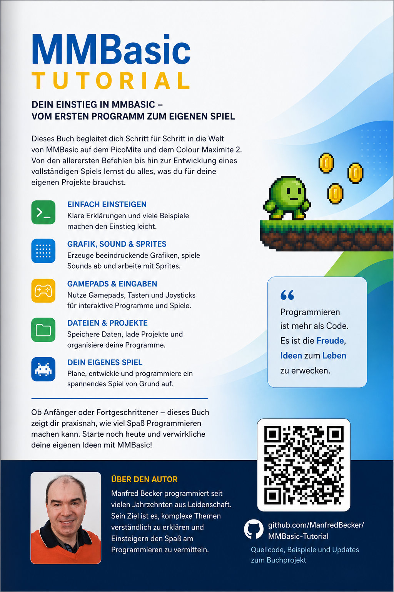

= Mein erstes MMBasic Programm
Manfred Becker
:doctype: book
:notitle:
:toc: macro
:toclevels: 1
:sectnums:
:icons: font
:revnumber: 0.14
:revdate: 2026-07-20

image::bilder/cover.png[pdfwidth=100%,align=center]

<<<

[.text-center]
= Mein erstes MMBasic Programm

[.text-center]
*Schritt für Schritt in die Welt von MMBasic*

[.text-center]
für PicoMite und Colour Maximite

[.text-center]
Manfred Becker

[.text-center]
Version {revnumber} +
{revdate}

<<<

[colophon]
== Impressum

Autor: Manfred Becker

Projektseite: +
https://github.com/ManiBecker/MeinErstesMMBasicProgramm

Dieses Tutorial entsteht Schritt für Schritt öffentlich auf GitHub.

MMBasic wurde von Geoff Graham entwickelt und von der MMBasic-Community weitergeführt und erweitert.

<<<

toc::[]

<<<

include::kapitel/00-willkommen.adoc[]

= Teil I – Einstieg in MMBasic

include::kapitel/01-hallo-welt.adoc[]

include::kapitel/02-mit-mmbasic-rechnen.adoc[]

include::kapitel/03-variablen.adoc[]

include::kapitel/04-benutzereingaben-mit-input.adoc[]

include::kapitel/05-entscheidungen-mit-if.adoc[]

include::kapitel/06-schleifen-mit-for-next.adoc[]

include::kapitel/07-zufallszahlen.adoc[]

include::kapitel/08-zahlenraten.adoc[]

include::kapitel/09-zahlenraten-v2.adoc[]

= Teil II – Größere Programme entwickeln

include::kapitel/10-sub-und-function.adoc[]

include::kapitel/11-arrays.adoc[]

include::kapitel/12-mit-texten-arbeiten.adoc[]

include::kapitel/13-little-professor.adoc[]

include::kapitel/14-little-professor-v2.adoc[]

include::kapitel/15-little-professor-v3.adoc[]

include::kapitel/16-dateien.adoc[]

= Teil III – Grafik und Spiele

include::kapitel/17-die-verschiedenen-grafikmodi.adoc[]

include::kapitel/18-farben-und-schriftarten.adoc[]

include::kapitel/19-die-ersten-grafikbefehle.adoc[]

include::kapitel/20-rechtecke-kreise-und-texte.adoc[]

include::kapitel/21-treffe-die-scheibe.adoc[]

include::kapitel/22-treffe-die-scheibe-v2.adoc[]

include::kapitel/23-treffe-die-scheibe-v3.adoc[]

include::kapitel/24-analoge-bahnhofsuhr.adoc[]

include::kapitel/25-geometrische-muster-und-spirographen.adoc[]

include::kapitel/26-animationen-und-bewegte-grafiken.adoc[]

include::kapitel/27-flackerfreie-grafik-mit-framebuffer.adoc[]

include::kapitel/28-layerbuffer-und-bewegliche-objekte.adoc[]

include::kapitel/29-pong.adoc[]

= Teil IV – Hardware und Elektronik

include::kapitel/30-digitale-ein-und-ausgaenge.adoc[]

include::kapitel/31-eine-led-zum-blinken-bringen.adoc[]

include::kapitel/32-taster-und-schalter.adoc[]

include::kapitel/33-eine-ampelsteuerung.adoc[]

include::kapitel/34-analoge-eingaenge.adoc[]

include::kapitel/35-pwm-und-led-dimmer.adoc[]

include::kapitel/36-toene-und-piezo-summer.adoc[]

include::kapitel/37-senso-das-elektronische-gedaechtnisspiel.adoc[]

= Teil V – Werkzeuge und Entwicklung

include::kapitel/38-der-eingebaute-editor.adoc[]

include::kapitel/39-programmieren-mit-mmedit.adoc[]

= Teil VI – Dateien und Projekte

include::kapitel/40-programme-speichern-und-laden.adoc[]

include::kapitel/41-dateiverwaltung-auf-der-sd-karte.adoc[]

include::kapitel/42-programme-verketten-mit-chain.adoc[]

include::kapitel/43-nuetzliche-systeminformationen.adoc[]

= Teil VII – Fortgeschrittene Techniken

include::kapitel/44-wichtige-option-befehle.adoc[]

include::kapitel/45-ereignisgesteuerte-programmierung-mit-interrupts.adoc[]

include::kapitel/46-datum-und-uhrzeit.adoc[]

include::kapitel/47-serielle-kommunikation.adoc[]

include::kapitel/48-ws2812-rgb-leds.adoc[]

include::kapitel/49-spielcontroller-und-gamepads.adoc[]

include::kapitel/50-sprites-und-blit.adoc[]

include::kapitel/51-von-der-idee-zum-fertigen-spiel.adoc[]

= Epilog

include::kapitel/52-epilog.adoc[]

= Anhang

include::anhang/anhang-a-mmbasic-befehlsreferenz.adoc[]

<<<

