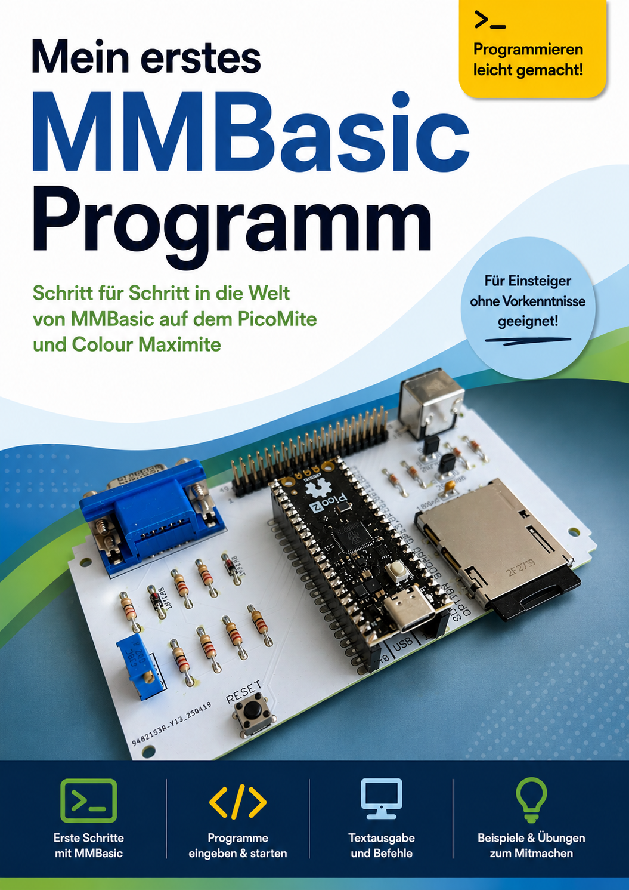

= Mein erstes MMBasic Programm
Manfred Becker
:doctype: book
:notitle:
:toc: macro
:toclevels: 1
:sectnums:
:icons: font
:revnumber: 0.05
:revdate: 2026-07-10

<<<

[.text-center]
= Mein erstes MMBasic Programm

[.text-center]
*Schritt für Schritt in die Welt von MMBasic*

[.text-center]
für PicoMite und Colour Maximite

[.text-center]
Manfred Becker

[.text-center]
Version {revnumber} +
{revdate}

<<<

[colophon]
== Impressum

Autor: Manfred Becker

Projektseite: +
https://github.com/ManiBecker/MeinErstesMMBasicProgramm

Dieses Tutorial entsteht Schritt für Schritt öffentlich auf GitHub.

MMBasic wurde von Geoff Graham entwickelt und von der MMBasic-Community weitergeführt und erweitert.

<<<

toc::[]

<<<

include::kapitel/00-willkommen.adoc[]

include::kapitel/01-hallo-welt.adoc[]

include::kapitel/02-mit-mmbasic-rechnen.adoc[]

include::kapitel/03-variablen.adoc[]

include::kapitel/04-benutzereingaben-mit-input.adoc[]

include::kapitel/05-entscheidungen-mit-if.adoc[]

include::kapitel/06-schleifen-mit-for-next.adoc[]

include::kapitel/07-zufallszahlen.adoc[]

include::kapitel/08-zahlenraten.adoc[]

include::kapitel/09-zahlenraten-v2.adoc[]

include::kapitel/10-sub-und-function.adoc[]

include::kapitel/11-arrays.adoc[]

include::kapitel/12-mit-texten-arbeiten.adoc[]

include::kapitel/13-little-professor.adoc[]

include::kapitel/14-little-professor-v2.adoc[]

include::kapitel/15-little-professor-v3.adoc[]

include::kapitel/16-dateien.adoc[]

include::kapitel/17-die-verschiedenen-grafikmodi.adoc[]